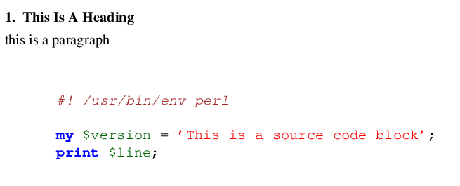

# ghighlight

This is a groff preprocessor written in perl that will highlight your code for you. All of the syntax highlighting is done by [GNU Source-highlight][https://www.gnu.org/software/src-highlite/#mozTocId323328] This way the highlighting can be modified and customized as needed. Currently the only macros supported are mm and ms macros.


### NOTE

This project is currently in alpha stages and still needs work before it is functional.

### Prerequisites

You will need the following programs installed:

- Perl (only tested on 5.8)
- GNU Source-highlight
- Groff


### Installing

Simply add source-highlight.pl to your path 

## Usage

Inside your groff file add .SOURCE and .SOURCE stop to start and stop a source code section. source-highlight will automatically detect the syntax based on the source code inside the block.

FILE.ms
```
.NH
This Is A Heading
.LP
this is a paragraph

.\" start source code block
.SOURCE
#! /usr/bin/env perl

my $version = 'This is a source code block';
print $line; 
.SOURCE stop
.\" end source code block
```

```
source-highlite.pl FILE.ms | groff -T pdf -ms > output.pdf
```




## Contributing

Please read [CONTRIBUTING.md](https://github.com/Gavinok/ghighlight/contributing.md) for details on our code of conduct, and the process for submitting pull requests to us.

## Todo
- [ ] Toggling (bold instead of color)
- [ ] Arguments to specify language in case Source-highlight doesn't recognize it
- [ ] Correct error messages
- [ ] Support for mom macros

## Authors

* **Gavin Jaeger-Freeborn** - *Initial work* - [Gavinok](https://github.com/Gavinok)

See also the list of [contributors](https://github.com/Gavinok/ghighlight/contributors) who participated in this project.

## License

This project is licensed under the GNU General Public License - see the [LICENSE](LICENSE) file for details

## Acknowledgments

* gperl written by Bernd Warken was used as the basis for this project
